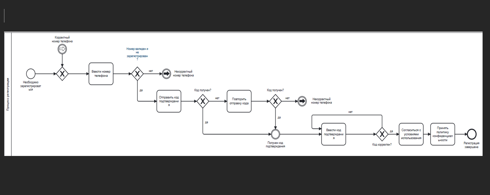

# Тестовое задание BA/PM
## Для выполнения данного задания был выбран данный продукт:Atlasbus (Транспортные услуги)
 ## Сервис поиска и покупки билетов на автобусы 
 ## https://atlasbus.by/
# Часть 1. Анализ текущего состояния 
## 1.1. Основные функции и пользователи 

Atlasbus - это онлайн-платформа для поиска и покупки билетов на автобусы и маршрутки по Беларуси и России. Сервис объединяет перевозчиков, позволяя пользователям сравнивать рейсы, выбирать места и оплачивать билеты онлайн.
Основные пользователи:
1.	Люди, ценящие время и мобильность.
2.	Пассажиры с срочными поездками.
3.	Пользователей, стремящихся к оптимизации расходов.
Какие потребности сервис закрывает:
1.	Покупка билета онлайн за пару кликов без очередей и похода в кассу.
2.	Быстрый поиск доступных рейсов в разное время суток, когда поезда или обычный транспорт не подходят по расписанию.
3.	Возможность оперативно забронировать место перед самой поездкой.
4.	Более низкие цены за счёт повышения эффективности работы партнёров перевозчиков.
5.	Доступ к актуальной информации о рейсах и возможность обратиться в поддержку при вопросах или проблемах.

## 1.2. Схема ключевого процесса

## Для выполнения данного задания был выбран процесс регистрации пользователя.
## Блок-схема регистрации пользователя находится в ba директории. 

Процесс регистрации начинается с того, что пользователь вводит свой номер телефона в соответствующее поле. После ввода система проверяет, соответствует ли номер установленному формату (например, содержит код страны и нужное количество цифр), а также отсутствует ли этот номер в базе уже зарегистрированных пользователей. Если номер оказывается некорректным или уже занят, система возвращает пользователя на шаг ввода номера с указанием на ошибку, чтобы он мог исправить данные. Если же номер валиден и не зарегистрирован, система переходит к следующему этапу.

На следующем этапе система генерирует одноразовый код подтверждения и отправляет его на указанный номер телефона через SMS. После отправки система ожидает от пользователя подтверждения того, что код был получен. Если пользователь не получил сообщение, он может запросить повторную отправку кода. В этом случае система повторно генерирует и отправляет новый код, после чего снова проверяет факт получения. Если код не был получен, то номер указывается некорректным и система возвращает пользователя на шаг ввода номера.

Когда пользователь подтверждает, что код получен, система переходит к этапу ввода кода подтверждения. Пользователь вводит полученный код в интерфейсе, а система проверяет его корректность. Если введённый код не совпадает с отправленным, пользователю предлагается ввести код заново. Если код введён верно, система считает номер телефона подтверждённым и переходит к этапу юридических согласий.

На этапе юридических согласий система последовательно запрашивает у пользователя принятие двух документов: сначала политики конфиденциальности, затем условий использования. После того как все согласия получены, система завершает регистрацию. На этом процесс регистрации считается завершённым.

## 1.3. Пользовательские боли и проблемы 

### 1. Отмены рейсов и смена транспорта без своевременных уведомлений
Пользователи регулярно жалуются, что узнают об отмене рейса или изменении транспорта слишком поздно или вообще случайно, хотя по правилам сервис заявляет «уведомляем заранее, предлагаем альтернативу». В отзывах описывают ситуации, когда SMS/уведомление об отмене приходит уже после того, как человек сел в автобус, или когда уведомления нет вовсе, а рейс исчезает или не приезжает. Это означает неустойчивую связку бэкенда и фронтенда: статус «подтверждён» или «активен» может отображаться, когда рейс уже отменён в системе перевозчика. В результате пользователь продолжает планировать поездку, может не искать альтернативу, а когда в последний момент выясняется, что рейса нет, времени купить другие билеты уже нет и всё «разобрано». Пользователь перестаёт доверять информации на сайте и относится с настороженностью.
### 2. Ограничение продаж только на 2 недели вперёд
По наблюдениям пользователей и практике сервиса, на многих направлениях билеты через сайт можно купить лишь в очень ограниченном горизонте - примерно 1-2 недели вперёд, а не за месяц или больше. Это усложняет планирование поездок заранее: чтобы поехать, скажем, через месяц, человек не может просто забронировать билет на atlasbus.by, ему нужно ставить себе напоминания и «ловить» появление рейсов за пару недель до даты.
Это проблема в двух плоскостях. Во первых, вы теряете пользователей, которые любят планировать заранее: они идут к альтернативным каналам, где можно купить билет «на месяц и больше вперед». Во вторых, когда открывается короткое окно продаж (2 недели), высок спрос и билеты быстро раскупаются; часть аудитории в этот период просто не успевает купить, потому что не смогла зайти на сайт/вовремя отследить открытие продаж. Это снижает глубину использования и долю поездок, которые пользователь готов доверить именно этому сайту.
### 3. Долгая загрузка, зависания и «рассинхрон» статуса билета
В отзывах о сайте и приложении пользователи отмечают, что ресурс работает нестабильно. Страницы долго грузятся, при открытии может «зависнуть на заставке», периодически вылетает или «подвисает» на этапе оформления брони. Часто описывается ситуация, когда пользователь вроде бы оформил заказ, но в личном кабинете или в списке поездок он не отображается, а при повторной попытке купить тот же рейс места уже отсутствуют.
С технической точки зрения это выглядит как комбинация проблем: тяжелая главная страница (баннеры, сторонние скрипты), не оптимизированные запросы к бэкенду и слабая обработка ошибок на фронтенде. Пользователь видит «крутилку» или пустую страницу, не понимает, оформился ли билет, боится обновлять, а в этот момент система может либо зарезервировать место (без корректного статуса в интерфейсе), либо наоборот - не завершить операцию и освободить место для других. В пиковые моменты (перед праздниками, при массовой отмене направления) это приводит к тому, что места быстро раскупают те, у кого сайт «успел загрузиться», а остальные остаются без билетов и с ощущением, что им «не дали купить, хотя я был заранее». Каждый раз, когда пользователь сталкивается с подвисанием или рассинхроном статуса, растёт ощущение, что «на Atlas нельзя рассчитывать», и в следующий раз он либо сразу идёт к конкурентам, либо покупает билеты меньше и позже.

# Часть 2. Стратегия и AI-идеи 
## 2.1. Product Vision 

Через два года «Атласбас» станет умным онлайн сервисом для поездок с более низкими ценами и большим количеством маршрутов за счёт роста числа партнёров перевозчиков. Пользователь сможет просто доверить планирование поездок приложению: оно быстро покажет актуальные варианты и позволит купить билет в один клик с круглосуточной поддержкой.

## 2.2. Стратегическая цель на год

Цель для команды: обеспечить полную прозрачность и предсказуемость статуса бронирования для пользователя при любом уровне нагрузки.
Почему именно она: сейчас сайт часто долго грузится, вылетает или зависает на шаге оплаты, а оформленный билет может не появляться в личном кабинете. В такой ситуации человек не понимает, купил он билет или нет, боится обновлять страницу и рискует остаться без места, потому что рейс пока «резервируется» в системе, а затем может быть выкуплен другими. Каждый такой сбой напрямую режет конверсию (часть людей вообще не может завершить покупку) и разрушает доверие: пользователь запоминает не цену и удобство, а стресс «вроде купил, но билета нет» и в следующий раз либо идёт к конкурентам, либо откладывает покупку до последнего момента.

## 2.3. Генерация AI-идей 

### 1.Прогнозирование спроса
AI смотрит, что люди ищут и бронирую и заранее понимает, где будет наибольшая нагрузка. В результате перевозчики в вовремя добавляют рейсы, ездят с полной загрузкой и могут держать цены для пассажиров низкими.
### 2.Автоматическая поддержка 24/7
Чат бот на AI берёт на себя всю нагрузку: багаж, возвраты, переносы, статусы рейсов. Пользователь пишет в любое время суток и сразу получает ответ, а операторы могут нормально разбирать сложные кейсы.
### 3.Умная локализация и подсказки в интерфейсе
Автоматическое исправление технических ошибок. Вместо фраз «Date should not be before minimal date» AI показывает перевод сообщения на выбранный язык пользователя. Интерфейс становится понятным, помогая быстро купить билет.
### 4.Персонализированный поиск
Система запоминает, как и когда пользователь обычно ездит, и предлагает ему нужные маршруты в удобное время, когда расписание другого транспорта недоступно. В итоге человек меньше тратит времени на поиск, чаще находит удобный рейс.

## 2.4. Выбор лучшей идеи 

Самая полезная и реалистичная идея – внедрение системы AI-прогнозирования спроса.
Эта идея напрямую помогает использовать технологии для увеличения эффективности работы партнёров, что позволяет делать цены ниже. Прогнозирование решает глобальную проблему нехватки мест на популярных направлениях (таких как Минск - Могилев или Логойск - Минск) в пиковые часы. Сервис может гарантировать наличие билетов и стабильную выручку для перевозчиков.
Фокусируясь на аналитике данных и работе с партнерами, вероятно, придется отказаться от создания бота для поддержки 24/7. Разработка и обучение требует больших ресурсов и долгого тестирования, чтобы он мог не ошибаться в юридически значимых вопросах (условия возврата, правила перевозки).
На данном этапе стоит отдать предпочтение прогнозированию, так как оно дает максимальный финансовый эффект для бизнеса и решает главную проблему пассажира – отсутствие билета в нужное время.

# Часть 3. Рефлексия использования AI 
## 3.1. Промпты и анализ 

### Промпт для сбора информации о проблемах «Атласбас»: 
 Проведи исследование пользовательского опыта сервиса Атласбас (сайт atlasbus.by). Сервис обещает низкие цены, поддержку 24/7, быстрый поиск по множеству направлений. Найди в интернете (отзовики, соцсети, магазины приложений) реальные отзывы пользователей за последний год. Не делай общих выводов, а найди конкретные критические ошибки и «боли». Обрати внимание на данные вопросы:
•	Какие баги или странные сообщения в интерфейсе мешают людям купить билет? Есть ли проблемы со стабильностью сайта или приложения?
•	Всегда ли билеты, купленные через сервис, принимаются водителями без распечатки?
•	Насколько актуальна информация о рейсах и наличии мест, которую предоставляют партнеры?
•	 Как быстро и эффективно операторы решают проблемы в чате или по телефону?
Составь список из 5 самых серьезных проблем, которые чаще всего упоминают пользователи и приведи примеры их жалоб.
### Промпт для простого и точного анализа идей:
 Ты - Senior Business Analyst. Помоги мне разобраться в планах развития сервиса Атласбас (сайт atlasbus.by). Это площадка, где люди покупают билеты на маршрутки. Посмотри на 4 идеи ниже. Скажи мне просто и понятно: какую из них нам нужно внедрить самой первой, а какую лучше пока отложить? Объясни свое решение, учитывая, что цель - сделать сервис удобнее и помочь перевозчикам работать эффективнее.
Идеи для оценки: 
1.Прогнозирование спроса
AI смотрит, что люди ищут и бронирую и заранее понимает, где будет наибольшая нагрузка. В результате перевозчики в вовремя добавляют рейсы, ездят с полной загрузкой и могут держать цены для пассажиров низкими.
2.Автоматическая поддержка 24/7
Чат бот на AI берёт на себя всю нагрузку: багаж, возвраты, переносы, статусы рейсов. Пользователь пишет в любое время суток и сразу получает ответ, а операторы могут нормально разбирать сложные кейсы.
3.Умная локализация и подсказки в интерфейсе
Автоматическое исправление технических ошибок. Вместо фраз «Date should not be before minimal date» AI показывает перевод сообщения на выбранный язык пользователя. Интерфейс становится понятным, помогая быстро купить билет.
4.Персонализированный поиск
Система запоминает, как и когда пользователь обычно ездит, и предлагает ему нужные маршруты в удобное время, когда расписание другого транспорта недоступно. В итоге человек меньше тратит времени на поиск, чаще находит удобный рейс.
Отчет составь в таком виде: название идеи и почему она принесет больше всего пользы прямо сейчас. Также укажи, какую идею слишком сложно или дорого внедрять прямо сейчас и почему.

## 3.2. На каких этапах помог AI?

Я разделила задачи между двумя AI-инструментами:
Perplexity: с помощью промпта для сбора информации о проблемах «Атласбас» были найдены настоящие проблемы пользователей: технические сбои, проблемы с несоответствием данных от партнеров и случаи, кода водители не принимали электронные билеты, вопреки правилам сервиса.
NotebookLM: использовался для анализа источников и синтеза стратегии. С помощью промпта для анализа идей от лица Senior BA были сопоставлены возможности платформы carbus.io с бизнес-целями компании. Это помогло систематизировать идеи по принципу «максимальная польза для бизнеса при минимальных рисках».

## 3.3. Где я положилась только на свой опыт? 

Из источников я выделила, что «Атласбас» - это платформа, которая играет роль посредника между пользователями и перевозчиками. Поэтому при выборе лучшей идеи я отклонила «Персонализированный поиск» как слишком сложный и дорогой на текущем этапе. Я выбрала «Прогнозирование спроса», так как оно напрямую решает главную задачу бизнеса – повышение эффективности партнеров для удержания низких цен. Так же при формулировании идей про умную локализацию и автоматизацию поддержки важную роль сыграл личный опыт использования цифровых сервисов. В разных продуктах регулярно приходится долго ждать ответа от «24/7-поддержки» и сталкиваться с непонятными техническими сообщениями на английском (вроде ошибок про некорректную дату), которые мешают спокойно завершить покупку. Этот опыт показал, что проблема понятного языка и скорости реакции поддержки является общей для многих онлайн-сервисов, и поэтому эти области тоже были выделены как выжные точки применения AI.

## 3.4. Что нового вы узнали в процессе? 
 
Я поняла, насколько важно для продукта смотреть на пользовательский опыт через реальные отзывы, а не только через свое ощущение или маркетинговые обещания сервиса. В процессе стало видно, что именно конкретные истории пользователей (отмены рейсов, зависание сайта, проблемы с бронью) лучше всего показывают настоящие точки провала и помогают выбирать AI- решения, которые помогут повысить спрос и доверие пользователей.
